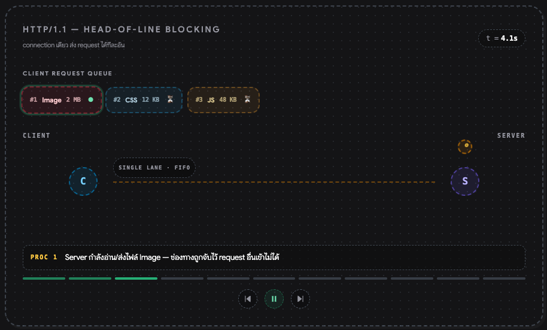
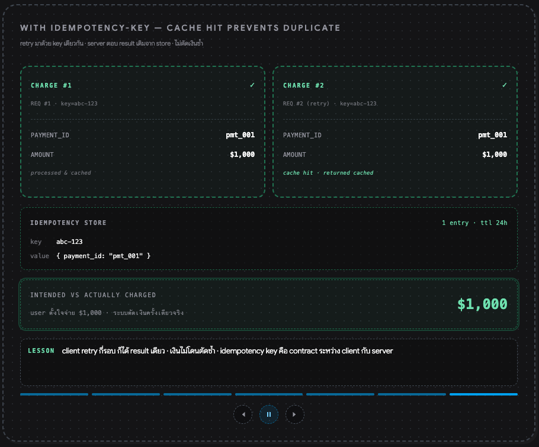

# Part 8: AI Usage

USE AI: ✅

## Assignments

### 1. What did AI help with?

#### For this project:

- Annotations for the code, such as comments and documentation.
- Generating unit tests following a given pattern.
- Generating specific unit tests like [calculator_test.go](../tests/calculator_test.go) by providing a task description.
- Extending, refining, grammar-checking and vocabulary imrpovements for the documentation and comments.

#### For my work in general:
- Code generation after discussion and design decisions, using **brainstorming** skills and custom skills following [Document Driven by Boristane](https://boristane.com/blog/how-i-use-claude-code/).
  1. Brainstorming step: I use AI to generate multiple design options, compare their pros and cons, and explore implementation details for a given task or problem. This helps me evaluate different approaches and make more informed decisions.
  2. Review and refine step: After generating the initial code, I review it for correctness, readability, maintainability, and consistency. I often find inconsistencies between the document or plan and the actual implementation.
  3. Todo list step: I use AI to create a todo list split into phases. This reduces the scope of each code review and makes the review more focused. It also helps me track progress and ensure that all parts of the task are covered.
  4. Code generation step: I use AI to generate code based on the design and todo list, implementing one phase at a time. This allows me to review and refine the code in smaller, more manageable chunks, which reduces the chance of errors.

#### Looking forward/improvements for AI Usage:

- I plan to apply [Structured Prompt-Driven Development (SPDD)](https://martinfowler.com/articles/structured-prompt-driven/).
- I plan to use the sub-agent pattern for more complex tasks to improve collaboration with AI, accelerate development, and improve code quality.
- I am exploring IDEs that support agentic development and sub-agents, such as `zed` or `bridgemind`. My goal is to review diffs and understand code changes more efficiently, especially when working with multiple branches or reviewing several diffs in parallel.

### 2. What did you verify yourself?

From the previous [question](#1-what-did-ai-help-with), I verified every step of the process because I found several recurring issues, such as:

1. Inconsistencies between the discussion, plan, and actual implementation.
2. Code quality issues, including redundant code, non-idiomatic code, unreadable code with high cognitive complexity, and maintainability problems.
3. Misunderstandings of the business context and requirements, which can lead to incorrect implementations.

### 3. What is one example where AI could be wrong?

In my works, I found many incorrect outputs from AI, but to be honest, I reviewed and fixed them, so I gonna pick one example that I easily found and mostly faced. (if it occurs again, I will update this section with a more specific example)

#### Example: Inconsistent implementation styles and incorrect details

For the same task and prompt, but with different context, AI can generate different implementation styles and may miss or include incorrect details. In one case, I found that it generated incorrect carousel code instead of reusing the existing `carousel` and `control-panel` components.

| First Generated | Second Generated |
| --- | --- |
|  |  |
